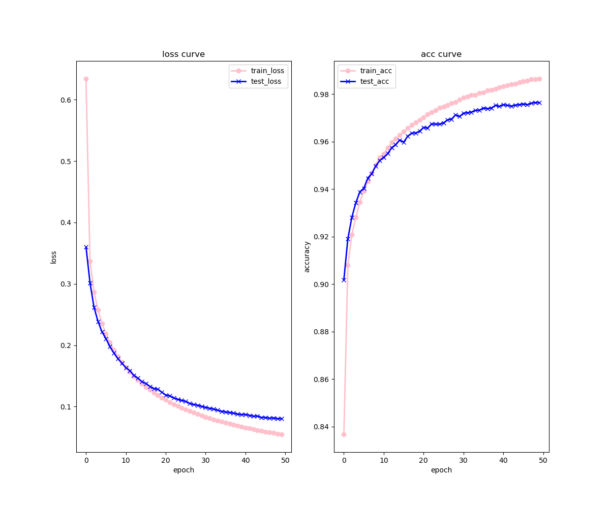

# torch-like numpy MLP
This repo implement a **torch-like MLP** framework which is suitable to solve classification problem.

realized function as following:
- Tensor : torch-like,use *.value* to visit the value (type : numpy.NDArray)
- Linear : a linear layer 
- CrossEntropyLoss : Negative Logistic Likelihood Loss (NLL Loss) with Softmax operation
    - backward of softmax + nll_loss will be more simple
- MLP: You can design your own MLP as you need (no matter how much the layers)
- state_dict save & load : like the torch framework, torch file named .pth, here named .qbw
- matplotlib.pyplot to show the train/test curve as following

